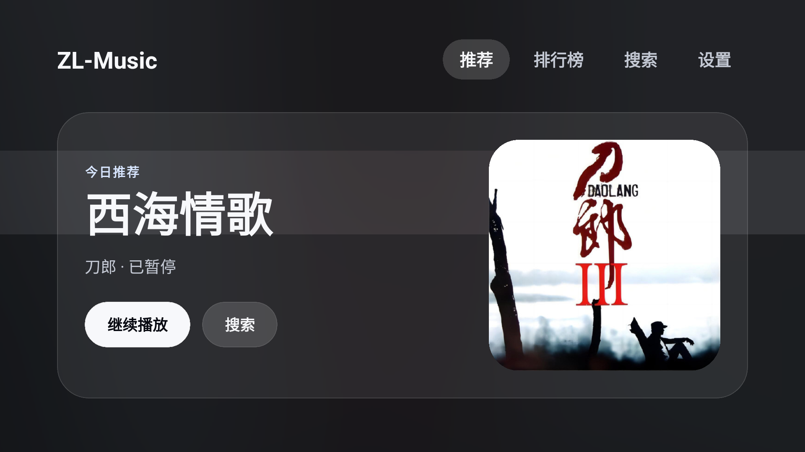
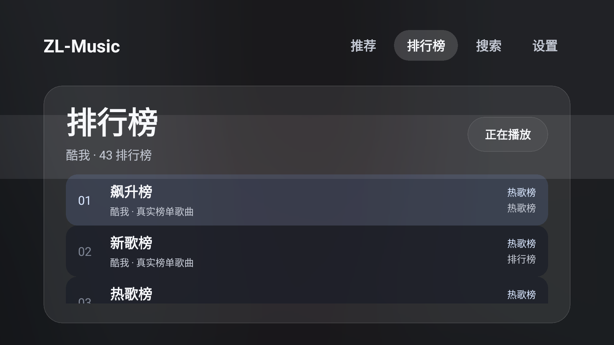
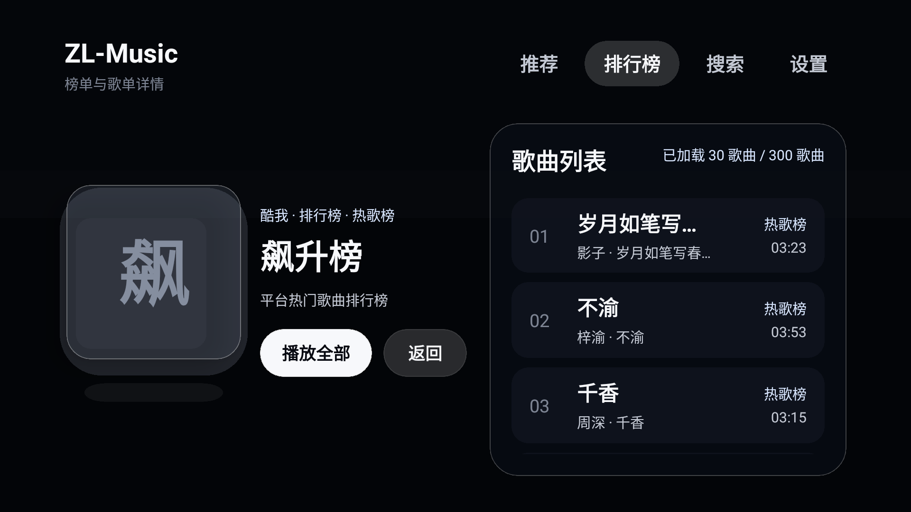
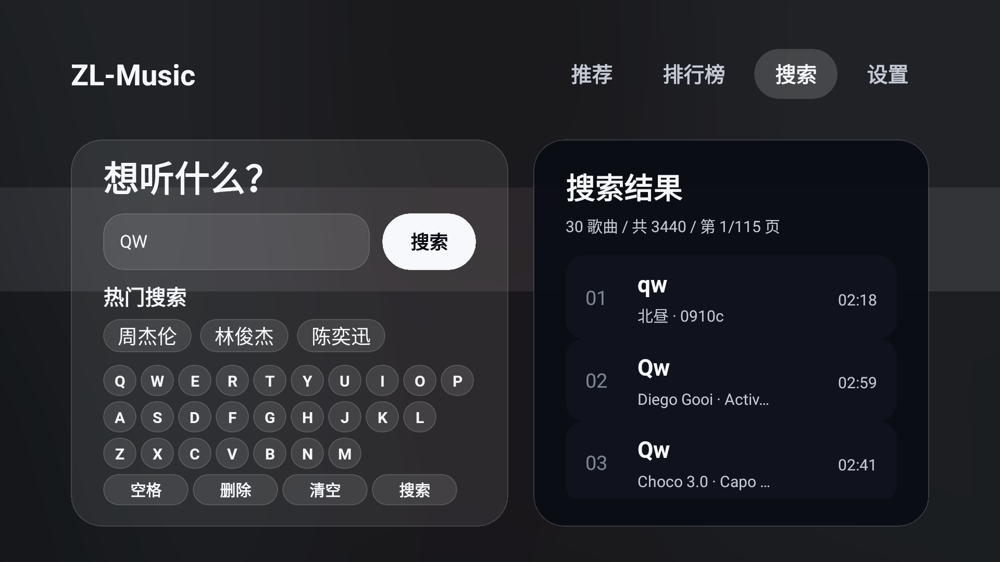
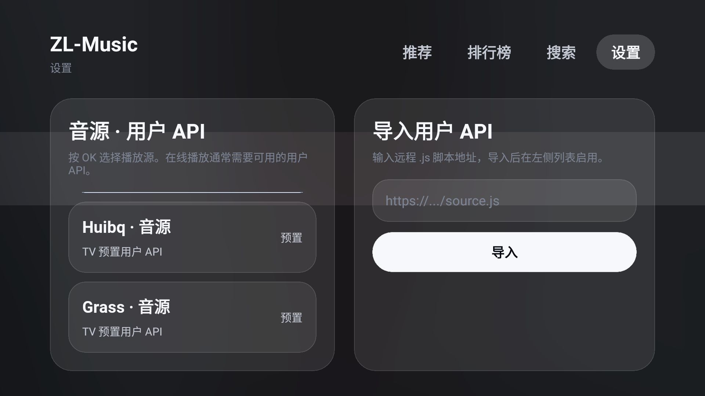
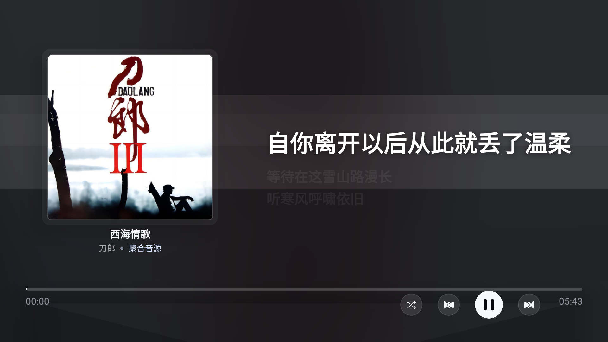

# ZL-Music TV

ZL-Music TV 是基于 [lx-music-mobile 1.8.4](https://github.com/lyswhut/lx-music-mobile) 二次开发的 Android TV 音乐播放器。当前版本重点重构了 TV 端体验：遥控器焦点、高亮反馈、排行榜、搜索、设置页、播放页和 Apple Music TV 风格的沉浸式背景。

> 本项目仅用于学习、研究与个人设备体验，不内置任何版权音乐资源，不提供付费分发服务。TV 界面改造由 Codex 全程协助编写；至于有没有“侵了谁的权”，我也不知道，如有权利问题请联系处理或删除相关内容。

## 界面预览

### 首页



### 排行榜



### 榜单详情



### 搜索



### 设置



### 播放页



## 主要特性

- TV 遥控器优先：方向键导航、OK 打开/播放、返回键回退、播放键暂停/继续。
- 首页打开后焦点默认在「推荐」，所有 TV 可聚焦控件都有明显高亮。
- 排行榜页面标题统一为「排行榜」，榜单行直接按 OK 进入详情。
- 搜索页移除音源选择和音源标签，结果列表直接展示歌曲名、歌手和时长。
- 设置页音源列表限制在卡片内部滚动，不再溢出背景块。
- 播放页参考 Apple Music TV 的比例重新布局：左侧封面、右侧歌词、底部进度条、右下角圆形控制按钮。
- 播放页新增播放方式圆形按钮，支持列表循环、随机、顺序、单曲循环等模式切换。
- 适配 75 寸 4K Android TV：针对 3840x2160 大屏限制 UI 最大缩放，提升远距离可读性，并降低 4K 背景模糊开销。
- APK Manifest 显式声明 Wi-Fi、以太网、触摸屏、faketouch、leanback 均非必需，减少电视安装器误判“不兼容”。

## 适配设备

已按用户电视信息做专项适配：

- 型号：FF 75S595C Ultra / 75S595C Ultra
- 分辨率：3840x2160
- 内存：4GB
- 存储：64GB

如果电视不确定 CPU 架构，优先安装 `universal` 包；多数 Android TV 可先尝试 `arm64-v8a` 包。

## 遥控器操作

| 按键 | 行为 |
| --- | --- |
| 方向键 | 移动焦点 |
| OK / Enter | 打开当前项、播放歌曲或触发按钮 |
| Back | 返回上一页 |
| Play/Pause | 播放页暂停或继续 |
| Previous / Rewind | 播放上一首 |
| Next / Fast Forward | 播放下一首 |
| Menu | 打开 TV 设置 |

## 环境要求

- Node.js 20+
- npm 8.5+
- JDK 17
- Android SDK / Gradle
- 夜神模拟器或 Android TV / Android 设备

## 安装依赖

```bash
npm install
```

## 构建 APK

```bash
npm run tv:assemble
```

构建产物位于：

```text
android/app/build/outputs/apk/release/lx-music-mobile-v1.8.5-x86.apk
android/app/build/outputs/apk/release/lx-music-mobile-v1.8.5-x86_64.apk
android/app/build/outputs/apk/release/lx-music-mobile-v1.8.5-arm64-v8a.apk
android/app/build/outputs/apk/release/lx-music-mobile-v1.8.5-armeabi-v7a.apk
android/app/build/outputs/apk/release/lx-music-mobile-v1.8.5-universal.apk
```

夜神模拟器优先使用 `x86` 包；真机或电视盒子不确定架构时可使用 `universal` 包。

## 安装到夜神模拟器

应用包名：`cn.toside.music.mobile`

```bash
npm run tv:deploy
```

手动安装示例：

```bash
C:\Data\NOX\Nox\bin\nox_adb.exe connect 127.0.0.1:62001
C:\Data\NOX\Nox\bin\nox_adb.exe -s 127.0.0.1:62001 install -r android\app\build\outputs\apk\release\lx-music-mobile-v1.8.5-x86.apk
C:\Data\NOX\Nox\bin\nox_adb.exe -s 127.0.0.1:62001 shell am start -n cn.toside.music.mobile/.MainActivity
```

## 代码检查

```bash
npm run tv:lint
```

本次发布前已验证：

```bash
npm run tv:lint
npm run tv:assemble
aapt dump badging android/app/build/outputs/apk/release/lx-music-mobile-v1.8.5-universal.apk
```

`aapt` 已确认 release 包没有 `application-debuggable`，并且 Wi-Fi、以太网、触摸屏等硬件特性均为 `uses-feature-not-required`。

## 目录结构

```text
src/
  components/TV/      TV 端基础组件、焦点组件、卡片、按钮、面板
  screens/TV/         TV 首页、排行榜、搜索、设置、播放页、队列页
  theme/tv.ts         TV 端颜色、圆角、间距、字号等设计 token
scripts/
  tv-build.cjs        构建 TV release APK
  tv-install.cjs      安装 APK
  tv-launch.cjs       启动应用
docs/screenshots/     README 使用的 TV 截图
```

## 发布说明

GitHub Releases / Tags 会上传最新构建好的 APK。推荐下载：

- `lx-music-mobile-v1.8.5-arm64-v8a.apk`：大多数 64 位 Android TV / 盒子。
- `lx-music-mobile-v1.8.5-universal.apk`：不确定设备架构时使用。
- `lx-music-mobile-v1.8.5-x86.apk`：夜神模拟器。

## 致谢

- [lx-music-mobile](https://github.com/lyswhut/lx-music-mobile)：原始移动端项目。
- Apple Music TV / tvOS：TV 端布局、比例和沉浸式播放页的视觉参考。
- Codex：本仓库 TV 端开发、调试、打包、截图巡检和 README 整理的主要协作者。

## License

沿用原项目协议，详见 [LICENSE](LICENSE)。
