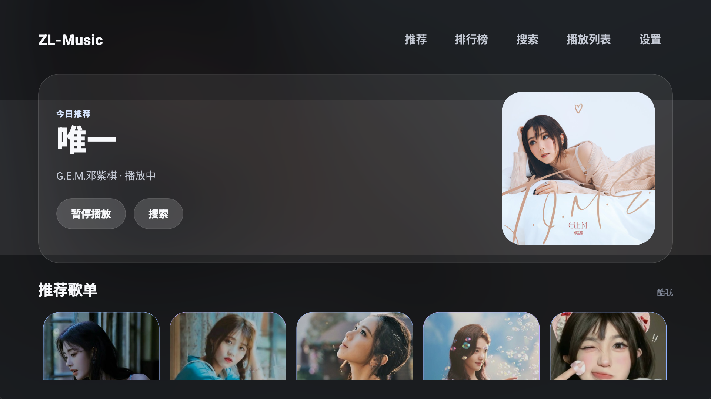
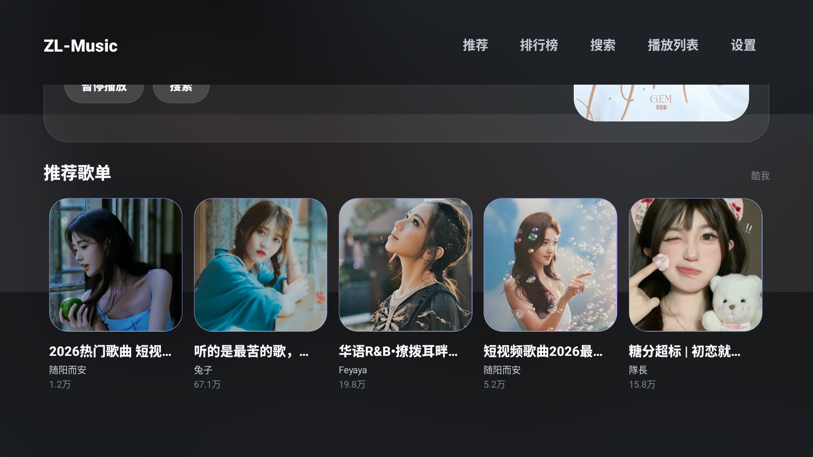
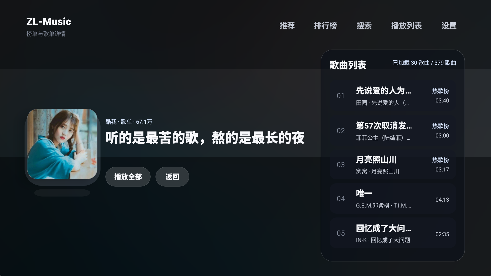
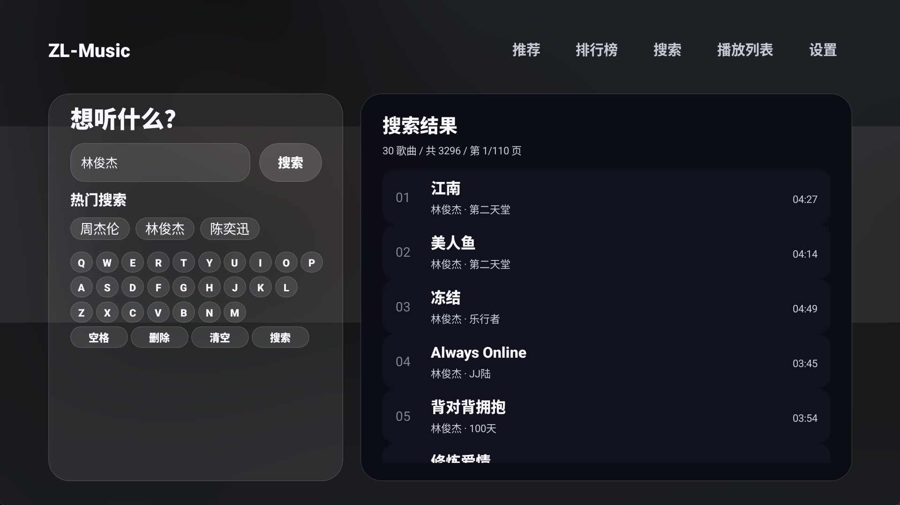
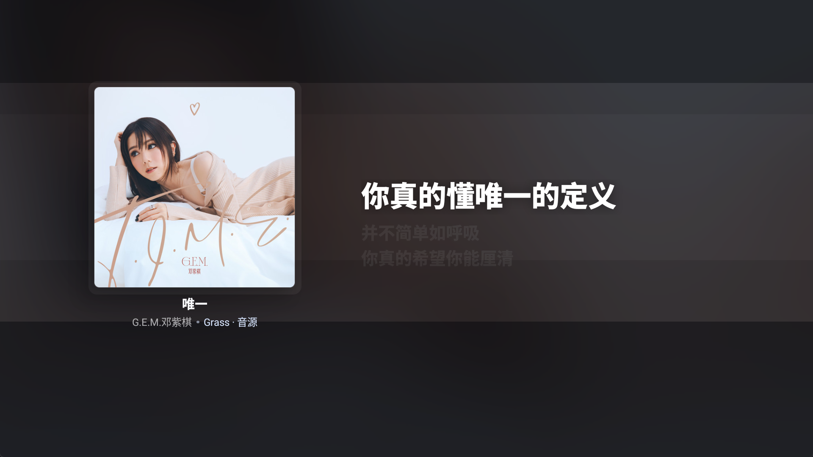
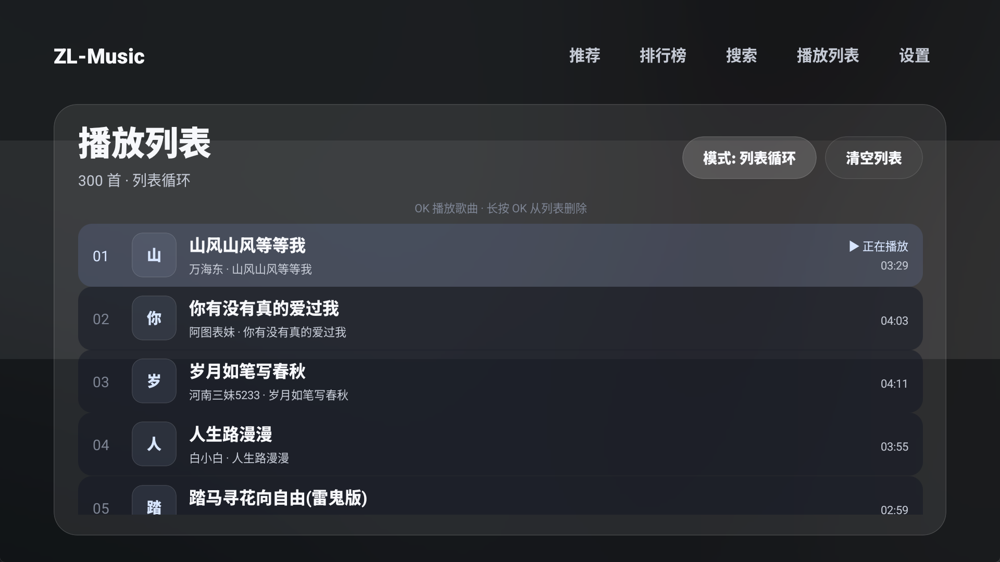
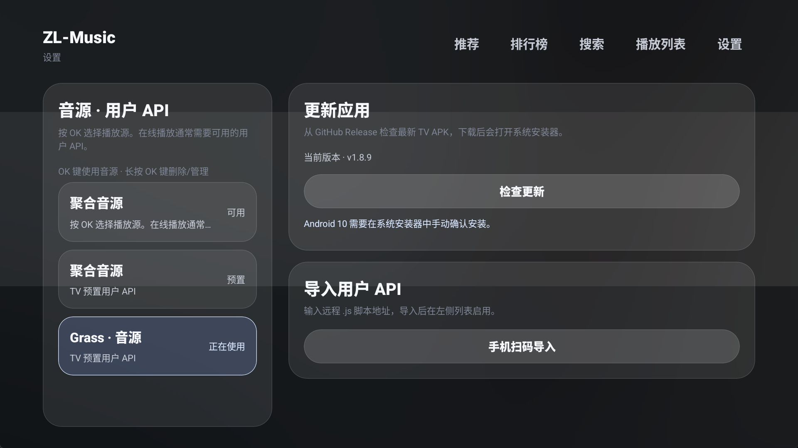

# ZL-Music TV

ZL-Music TV 是基于 [lx-music-mobile 1.8.4](https://github.com/lyswhut/lx-music-mobile) 二次开发的 Android TV 音乐播放器。当前版本（v1.8.8）重点建设了 TV 端体验：手机扫码导入音源、完整音源管理、拼音搜索联想、全分辨率等比适配与遥控器优先操作。

> 本项目仅用于学习、研究与个人设备体验，不内置任何版权音乐资源，不提供付费分发服务。TV 界面改造由 Codex 全程协助编写；至于有没有“侵了谁的权”，我也不知道，如有权利问题请联系处理或删除相关内容。

## 界面预览

### 首页



### 首页 · 沉浸模式



### 排行榜



### 搜索界面



### 播放详情页



### 播放列表



### 设置



## 主要特性

- **手机扫码导入音源**：电视端显示二维码，手机扫码（同一局域网）即可在手机浏览器里粘贴音源链接或脚本导入，告别遥控器输 URL。
- **完整音源管理**：设置页长按 OK 呼出音源操作菜单，所有音源（用户导入 / 预置 / 内置）均可删除；删除正在使用的音源自动回退聚合音源，当前歌曲播完为止。
- **拼音搜索联想**：内置 204 位热门华语歌手 + 221 首经典歌曲拼音词典，输全拼（`zhoujielun`）或首字母（`zjl`、`qt`）即出「猜你想搜」联想标签，选中直接搜索；全拼完全匹配自动纠偏为中文名。
- **TV 风格统一弹窗**：全部弹窗（操作菜单、删除确认、更新提醒、系统提示）使用统一的毛玻璃卡片风格，与整体 UI 一致。
- **全分辨率等比适配**：1080p / 4K（任意密度）下界面比例与 1080p 完全一致，高分屏仅更清晰，不再有“分割感”。
- **切后台自动暂停**：TV 端切到后台（Home / 其他应用）自动暂停播放，切回不自动恢复；手机端保持后台播放特性。
- 遥控器优先：方向键导航、OK 打开/播放、返回键回退、播放键暂停/继续。
- 播放页 Apple Music TV 风格沉浸式布局：左侧封面、右侧歌词、底部进度条、右下角圆形控制按钮。
- APK 体积优化：release 混淆构建 + 架构精简，包体积从 180MB 降至约 55MB（-69%）。

## 本次更新（v1.8.8）

- 新增：手机扫码导入音源（局域网内嵌 HTTP 服务 + 二维码 + 手机端导入页，支持列表管理 / 删除 / 切换音源）。
- 新增：音源长按 OK 操作菜单；更新提醒默认全部关闭，开启时弹窗说明利弊；新导入音源置顶显示。
- 新增：搜索拼音联想（歌手 + 歌曲双词典，全拼 / 首字母 / 自动纠偏）。
- 新增：TV 统一风格弹窗组件，替换全部原生 AlertDialog。
- 新增：GitHub Actions 云构建——push 到 master / dev 自动产出 release APK，Artifacts 直接下载。
- 优化：4K 等比适配，任意分辨率观感与 1080p 一致。
- 优化：TV 切后台自动暂停播放。
- 调整：菜单键不再跳转设置页（播放页呼出控制条，其他页面无动作）。
- 调整：预置音源精简为「聚合 API + 野草（最新版，jsdelivr 镜像自更新）」。
- 调整：CI 产物仅保留 arm64-v8a / x86_64 / universal 三种架构。

## 适配设备

- 全部分辨率等比适配：1080p 观感基准，4K（3840x2160，任意系统密度）下界面比例完全一致，仅更清晰。
- 已在 75 寸 4K Android TV（FF 75S595C Ultra，3840x2160 / 4GB+64GB）实测。
- 如果电视不确定 CPU 架构，优先安装 `universal` 包；多数 Android TV 可先尝试 `arm64-v8a` 包；模拟器用 `x86_64` 包。

## 遥控器操作

| 按键 | 行为 |
| --- | --- |
| 方向键 | 移动焦点 |
| OK / Enter | 打开当前项、播放歌曲或触发按钮 |
| **长按 OK**（音源列表） | 呼出音源操作菜单（删除 / 更新提醒） |
| Back | 返回上一页 |
| Play/Pause | 播放页暂停或继续 |
| Previous / Rewind | 播放上一首 |
| Next / Fast Forward | 播放下一首 |
| Menu | 播放页呼出/收起控制条，其他页面无动作 |

也可以在电脑端通过 ADB 调试遥控器按键：

```bash
npm run tv:remote -- up
npm run tv:remote -- right right ok
npm run tv:remote -- back
adb shell input keyevent 82   # 模拟 Menu 键
```

## 手机扫码导入音源

1. 设置 → 音源面板 → 「手机扫码导入」，电视显示二维码。
2. 手机连接同一 Wi-Fi，扫码打开导入页。
3. 粘贴音源脚本链接（如 `https://cdn.jsdelivr.net/gh/pdone/lx-music-source@main/grass/latest.js`）或直接粘贴脚本内容，点「导入到电视」。
4. 电视端列表实时更新；手机页还支持删除、切换已装音源。

## 环境要求

- Node.js 20+
- npm 8.5+
- JDK 17
- Android SDK / Gradle
- Android TV / 盒子 / 模拟器

## 下载与安装

**方式一（推荐）：GitHub Actions 自动构建**

每次 push 到 master / dev 后自动构建 release APK（R8 混淆 + debug 签名，可直接安装）：

1. 打开 [Actions](https://github.com/kaosZL/ZL_Musicos/actions) 页面，进入最新成功的构建。
2. 底部 Artifacts 下载 `ZL_Musicos-debug-apk-dev`（或 `-master`），解压得到 APK。
3. 电视/盒子装 `arm64-v8a`，模拟器装 `x86_64`，不确定就装 `universal`。

**方式二：本地构建**

```bash
npm install
npm run tv:assemble
```

构建产物位于（v1.8.8，三种架构）：

```text
android/app/build/outputs/apk/release/zl-music-v1.8.8-arm64-v8a.apk
android/app/build/outputs/apk/release/zl-music-v1.8.8-x86_64.apk
android/app/build/outputs/apk/release/zl-music-v1.8.8-universal.apk
```

应用包名：`cn.toside.music.mobile`

安装到模拟器示例：

```bash
adb connect 127.0.0.1:62001
adb -s 127.0.0.1:62001 install -r android/app/build/outputs/apk/release/zl-music-v1.8.8-x86_64.apk
```

## 代码检查

```bash
npm run tv:lint
```

## 目录结构

```text
src/
  components/TV/      TV 端基础组件（焦点、卡片、按钮、面板、TVDialog 统一弹窗）
  screens/TV/         TV 首页、排行榜、搜索、设置（扫码导入+音源管理）、播放页、队列页
  config/hotArtists.ts  热门歌手拼音词典（搜索联想）
  config/hotSongs.ts    热门歌曲拼音词典（搜索联想）
  theme/tv.ts         TV 设计 token + 全分辨率等比缩放
android/
  app/src/main/java/.../utils/LanImportServer.java   局域网扫码导入服务（NanoHTTPD）
  app/src/main/assets/lan_input.html                 手机端导入页
  app/src/main/assets/script/                        预置音源脚本
.github/workflows/build-apk.yml    CI 云构建（push 自动出 APK）
docs/screenshots/     README 使用的 TV 截图
```

## 发布说明

GitHub Releases / Tags 会上传最新构建好的 APK。推荐下载：

- `zl-music-v1.8.8-arm64-v8a.apk`：大多数 64 位 Android TV / 盒子。
- `zl-music-v1.8.8-universal.apk`：不确定设备架构时使用。
- `zl-music-v1.8.8-x86_64.apk`：模拟器。

## 致谢

- [lx-music-mobile](https://github.com/lyswhut/lx-music-mobile)：原始移动端项目。
- Apple Music TV / tvOS：TV 端布局、比例和沉浸式播放页的视觉参考。
- Codex：本仓库 TV 端开发、调试、打包、截图巡检和 README 整理的主要协作者。

## License

沿用原项目协议，详见 [LICENSE](LICENSE)。
